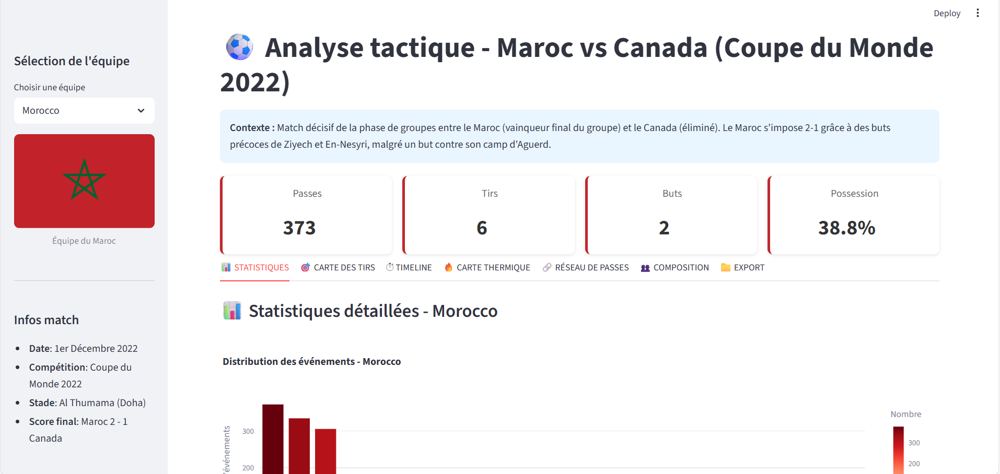
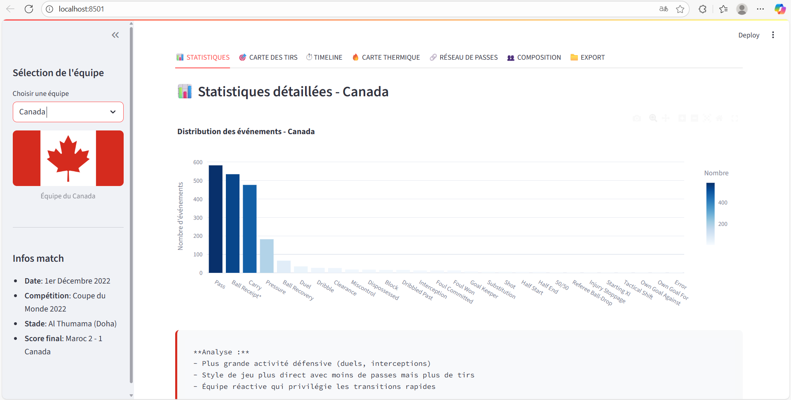
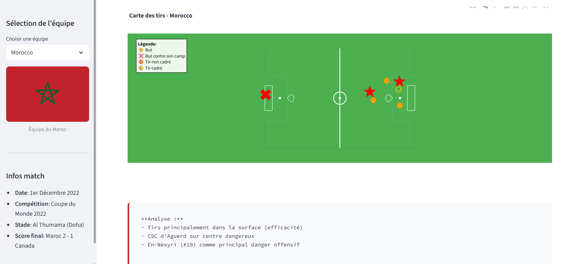
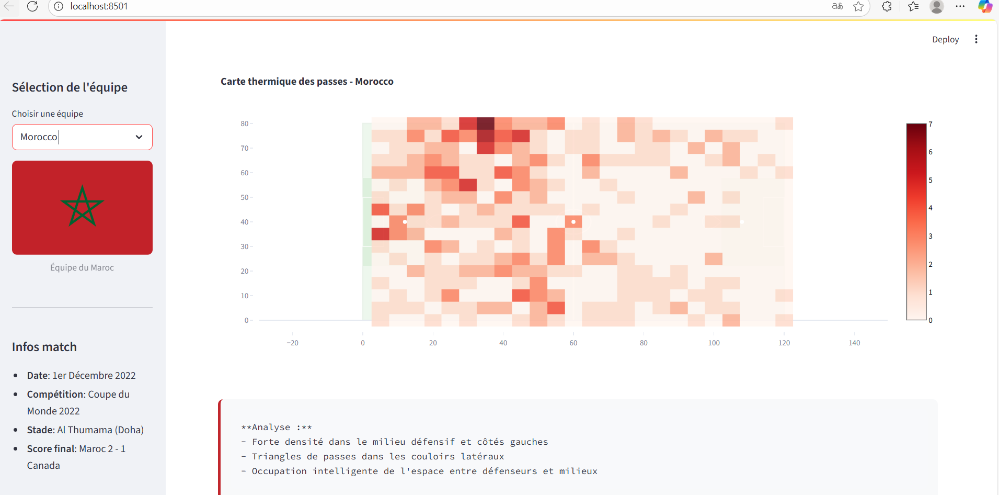
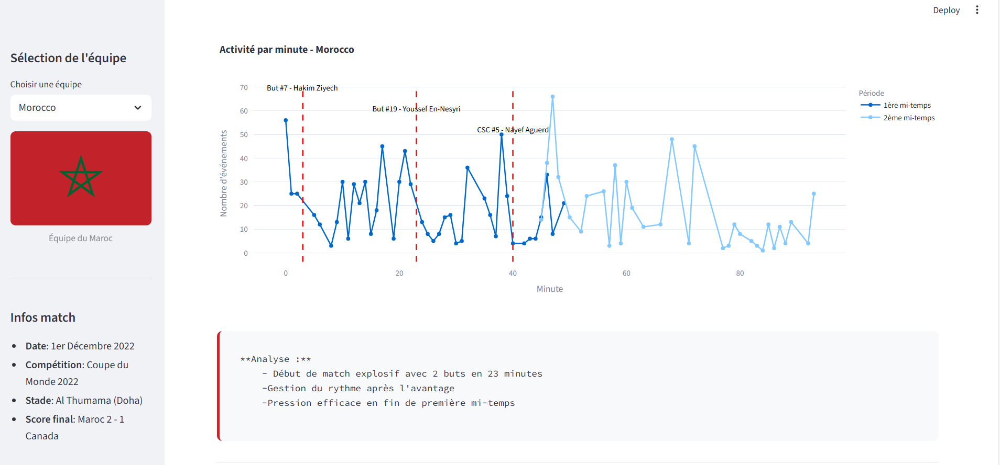

# ⚽ Analyse tactique - Maroc vs Canada (Coupe du Monde 2022)

Ce projet présente une **interface Streamlit** d’analyse tactique du match **Maroc 🇲🇦 vs Canada 🇨🇦** lors de la Coupe du Monde 2022.

L’application affiche :
- 🔢 **Statistiques globales** (passes, tirs, buts, possession)
- 🎯 **Carte des tirs**
- 🔥 **Carte thermique**
- 🧠 **Réseau de passes**
- ⏱️ **Timeline des événements**
- 📁 **Exportation des données**

---

## 📸 Aperçus de l’interface

### Page d'accueil

### Statistiques globales

### Carte des tirs

### Carte thermique

### Réseau de passes

### Timeline du match

---

## 🧠 Contexte du projet
Match décisif de la phase de groupes entre le **Maroc** (vainqueur final du groupe) et le **Canada** (éliminé).  
Le Maroc s’impose **2-1** grâce à des buts précoces de **Ziyech** et **En-Nesyri**.

---

## 👩‍💻 Réalisé par
**Yousra Youssoufi**  
Master *Transformation Digitale et Technologies du Sport*  
Projet académique – Analyse tactique assistée par données

---

📌 *Remarque : le code source complet n’est pas partagé publiquement.*
